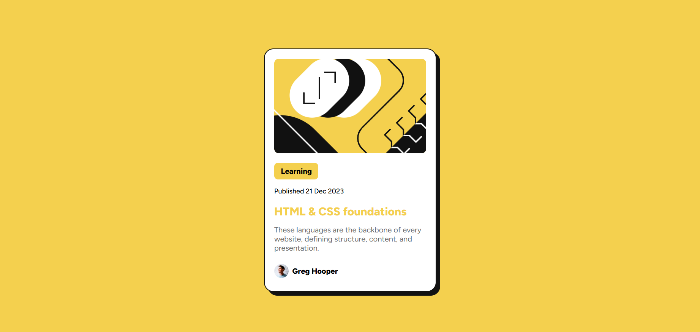

# Frontend Mentor - Blog preview card solution

This is a solution to the [Blog preview card challenge on Frontend Mentor](https://www.frontendmentor.io/challenges/blog-preview-card-ckPaj01IcS). Frontend Mentor challenges help you improve your coding skills by building realistic projects. 

## Table of contents

- [Overview](#overview)
  - [The challenge](#the-challenge)
  - [Screenshot](#screenshot)
  - [Links](#links)
- [My process](#my-process)
  - [Built with](#built-with)
  - [What I learned](#what-i-learned)
  - [Useful resources](#useful-resources)
- [Author](#author)

## Overview

### The challenge

Users should be able to:

- See hover and focus states for all interactive elements on the page

### Screenshot


Above is the final result of my solution for this challenge, with the blog card's title turning yellow when the mouse hovers over it or clicks it, like so:




### Links

- Solution URL: [Github Repository](https://github.com/realynnsio/challenge-blog-preview-card)
- Live Site URL: [Vercel Live Site](https://challenge-blog-preview-card-vert.vercel.app/)

## My process

### Built with

- Semantic HTML5 markup
- CSS custom properties
- Flexbox
- CSS Media Queries

### What I learned

Similarly to the previous challenge, I just used native CSS and very simple HTML to complete this blog preview card. One extra thing I utilized this time around though was **media queries**! I chose to use it because I noticed there's a more noticeable change in card size between the desktop and mobile version and wanted to faithfully recreate that:

```css
.card {
    width: 18rem;
    height: fit-content;
    ...
}

@media screen and (min-width: 480px) {
  .card {
    width: 20rem;
  }
}
```

Another thing I'm glad to have tried out in this challenge are **child combinators**, **pseudo-classes**, and using the **CSS selector list**:
```css
.card > h1:active,
.card > h1:hover {
    color: var(--yellow);
    cursor: pointer;
}
```
Using these concepts simplified the process of styling for me, but I wonder if my way of doing it is optimal yet or are there ways I could improve?

I also tried to minimize the use of custom classes in my HTML by using type selectors with child combinators when styling instead. Is this okay, or is it better to just have class names for each element of the blog preview card?


### Useful resources

- [Child Combinator](https://developer.mozilla.org/en-US/docs/Web/CSS/Child_combinator) - Documentation on the use of child combinators.
- [Pseudo-Classes](https://developer.mozilla.org/en-US/docs/Web/CSS/Pseudo-classes) - Documentation on pseudo-classes.
- [Selector List](https://developer.mozilla.org/en-US/docs/Web/CSS/Selector_list) - Documentation on Selector lists.
- [Media Queries](https://www.w3schools.com/css/css3_mediaqueries.asp) - Guide on the use and implementation of media queries.

## Author

- Website - [alma-nashrida](https://www.alma-nashrida.com)
- Frontend Mentor - [@realynnsio](https://www.frontendmentor.io/profile/realynnsio)
- LinkedIn - [Alma Putri Nashrida](https://www.linkedin.com/in/alma-putri-nashrida/)